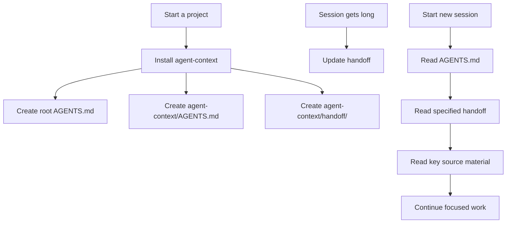

# Agent Context Kit

> A lightweight AGENTS.md + handoff workflow for AI agents.

一个轻量的 AI Agent 上下文管理工具包：
用 `AGENTS.md` 管长期规则，用 `handoff` 管会话交接，用项目源资料（source material）作为事实来源。

## 为什么需要它

AI agent 在长任务、多会话（session）、多仓库（repository）或工作区（workspace）中，常见问题是：

- 新会话不知道项目边界和稳定规则。
- 旧交接文档（handoff）被当成最新事实。
- 旧聊天记录过长，难以定位当前状态。
- `AGENTS.md` 越写越重，变成资料库、日志库或全文索引。
- Handoff 变成长篇背景、会议纪要或全项目总结。
- 项目源资料被复制进上下文文件，导致过期、重复和冲突。

Agent Context Kit 的解决方式很简单：

- `AGENTS.md`：保存长期稳定规则和项目导航。
- `handoff`：保存当前任务的最小接续状态。
- `source material`：作为项目真实事实来源，按需读取，不复制正文。

## 核心概念

### `AGENTS.md`

项目长期导航文件。它记录稳定的项目目标、边界、目录导航、工作规则和常见误区。

它不应该记录单个任务进度、长篇背景、项目源资料正文或原始讨论记录。

### `handoff`

会话 / 任务交接文档。它只记录新会话继续当前任务所需的最小状态：当前状态、已确定结论、卡点、下一步和关键文件。

### 项目源资料（source material）

项目中的真实事实来源。它可以是项目中任何提供事实、约束、上下文或参考价值的材料。

`AGENTS.md` 和 handoff 可以引用项目源资料路径，但不要复制大段正文或完整内容。

## 工作流



## 推荐目录结构

Skill 仓库结构：

```text
agent-context-kit/
  README.md
  LICENSE
  .gitignore
  .editorconfig
  agent-context-skill/
    SKILL.md
    templates/
      AGENTS.template.md
      handoff.template.md
    prompts/
      install-agent-context.md
      update-handoff.md
      start-from-handoff.md
      review-agent-context.md
```

目标项目生成结构：

```text
your-project/
  AGENTS.md
  agent-context/
    AGENTS.md
    handoff/
      {topic}-{YYYYMMDD}.md
```

根目录 `AGENTS.md` 负责让 Codex / Agent 自动发现入口。`agent-context/AGENTS.md` 负责承载详细但仍轻量的项目导航。

## 快速开始

### 1. 安装 / 复制

#### 作为 Codex Skill 使用

推荐路径：

```text
~/.codex/skills/agent-context-skill/
```

如果设置了 `CODEX_HOME`：

```text
$CODEX_HOME/skills/agent-context-skill/
```

#### 作为普通模板包使用

直接复制 `agent-context-skill/templates/` 和 `agent-context-skill/prompts/` 到目标项目，或手动使用其中的 prompt。

### 2. 初始化项目

使用：

```text
agent-context-skill/prompts/install-agent-context.md
```

它会帮助创建：

- 根目录 `AGENTS.md`
- `agent-context/AGENTS.md`
- `agent-context/handoff/`

### 3. 当前会话快满时

使用：

```text
agent-context-skill/prompts/update-handoff.md
```

用于更新当前任务的 handoff，保留继续工作所需的最小状态。

### 4. 新会话接续时

使用：

```text
agent-context-skill/prompts/start-from-handoff.md
```

用于读取 `AGENTS.md`、指定 handoff 和关键项目源资料，再继续聚焦工作。

### 5. 定期检查上下文系统

使用：

```text
agent-context-skill/prompts/review-agent-context.md
```

用于检查上下文膨胀（context bloat）、上下文漂移（context drift）、重复 handoff 和过期路径。

## 信息优先级

当不同信息来源出现冲突时，按以下优先级处理：

1. 用户当前明确指令
2. 项目源资料（source material）的当前内容
3. 根目录 `AGENTS.md` 与 `agent-context/AGENTS.md`
4. 指定交接文档（handoff）
5. 旧聊天记录、旧摘要或旧交接内容

如果 handoff 与当前项目源资料冲突，应报告冲突，并以当前项目源资料为准，除非用户另有说明。

## Handoff 命名建议

```text
agent-context/handoff/{topic}-{YYYYMMDD}.md
```

规则：

- 同一任务继续更新原 handoff。
- 不同任务新建独立 handoff。
- 已完成、重复或过期的 handoff 应标记 obsolete 或删除。
- 不要为同一任务反复创建多个 handoff。
- Handoff 文件名要稳定，不要每次随意变化。

## 禁止事项

- 不要把 `AGENTS.md` 变成资料库。
- 不要把 handoff 写成长篇背景。
- 不要复制项目源资料正文。
- 不要编造不存在的路径、资料类型或项目事实。
- 不要为同一任务反复创建多个 handoff。
- 不要绑定具体行业、业务类型、文档类型或技术栈。

## License

MIT
